# C4 Component Diagram — CourseReader (Level 3)

```mermaid
C4Component
  title Component Diagram — CourseReader

  Person(student, "Student", "Uses the app to study")

  Container_Boundary(fe, "Frontend (React 19 + TypeScript + Vite)") {

    Boundary(pages, "Pages (src/mainview/pages/)") {
      Component(dashboardPage, "DashboardPage", "React component", "Course library: CourseGrid, ResumeCard, StatsBar, ReviewNowPanel, greeting")
      Component(syllabusPage, "SyllabusPage", "React component", "Module list (ModuleRow): quiz/SRS due badges, open lesson/quiz")
      Component(lessonPage, "LessonPage", "React component", "Page transition wrapper (none/flip/slide/fade) + LessonSection")
      Component(quizPage, "QuizPage", "React component", "Combined module quiz (MCQ + cloze) → QuizSection")
      Component(cumulativeQuizPage, "CumulativeQuizPage", "React component", "Cumulative review (MCQ + cloze + TF) → CumulativeQuizSection")
      Component(quizHubPage, "QuizHubPage", "React component", "Course quiz list: module quizzes, cumulative reviews, attempt badges")
      Component(reviewPage, "ReviewPage", "React component", "SRS review → ReviewSection")
      Component(settingsPage, "SettingsPage", "React component", "Appearance, fonts, width, transitions, sync, locale, danger zone")
      Component(bookmarksPage, "BookmarksPage", "React component", "Saved hub: type tabs, course filter, grouped rows")
    }

    Boundary(sections, "Sections (src/mainview/sections/)") {
      Component(lessonSection, "LessonSection", "React component", "react-markdown reader, section nav, search, notes, highlights, AI, scroll-to-section")
      Component(quizSection, "QuizSection", "React component", "Combined MCQ + cloze quiz via useQuizEngine")
      Component(cumulativeQuizSection, "CumulativeQuizSection", "React component", "Mixed MCQ + cloze + TF, custom loader → api.quiz.cumulative()")
      Component(reviewSection, "ReviewSection", "React component", "SRS spaced repetition review via RPC")
      Component(lessonHelpers, "lessonHelpers.tsx", "Helpers", "getTextOffset TreeWalker, section walk, DOM filters (svg, data-code-copy)")
    }

    Boundary(layouts, "Layouts (src/mainview/layouts/)") {
      Component(pageLayout, "PageLayout", "React component", "Outer wrapper: header + content area")
      Component(pageHeader, "PageHeader", "React component", "Back button + title + action buttons")
      Component(pageContent, "PageContent", "React component", "Scrollable content container (flex flex-col invariant)")
    }

    Boundary(stores, "Zustand Stores (src/mainview/stores/)") {
      Component(viewStore, "useViewStore", "Zustand store", "View stack: push, pop, replace, popToRoot")
      Component(courseStore, "useCourseStore", "Zustand store", "Course list, load/reset/refresh")
      Component(settingsStore, "useSettingsStore", "Zustand store", "Font size, theme, content width, text/code font, transitions, locale, rightPanel")
      Component(quizStore, "useQuizStore", "Zustand store", "Quiz session: questions, score, cloze attempts/inputs, totalPoints")
      Component(completionStore, "useCompletionStore", "Zustand store", "Module completion status per course")
      Component(bookmarksStore, "useBookmarksStore", "Zustand store", "Bookmark CRUD (module/section/highlight kinds)")
      Component(highlightsStore, "useHighlightsStore", "Zustand store", "Highlight CRUD per module")
      Component(notesStore, "useNotesStore", "Zustand store", "Note CRUD per module")
      Component(lessonUIStore, "useLessonUIStore", "Zustand store", "Lesson UI state: active section, search query, sidebar tab")
      Component(lessonViewStore, "useLessonViewStore", "Zustand store", "Scroll container ref, markdownRef (highlight offset root), activeSectionID")
      Component(selectionStore, "useSelectionStore", "Zustand store", "Text selection state driving selection toolbar/editors")
      Component(pomodoroStore, "usePomodoroStore", "Zustand store", "Focus/break timer with session tracking")
      Component(syncStore, "useSyncStore", "Zustand store", "Remote content sync status, once-per-session auto-sync")
    }

    Boundary(hooks, "Hooks (src/mainview/hooks/ — 33 total, orchestration shown)") {
      Component(useAppInit, "useAppInit", "React hook", "One-time boot: course load, last session, auto-sync guard (didAutoSync)")
      Component(useDashboard, "useDashboard", "React hook", "Orchestrates courseStore + viewStore + completionStore for dashboard")
      Component(useLessonSection, "useLessonSection", "React hook", "Orchestrates lessonUIStore + notesStore + highlightsStore")
      Component(useLessonNav, "useLessonNav", "React hook", "Module navigation with direction tracking for transitions")
      Component(useQuizEngine, "useQuizEngine", "React hook (useReducer)", "Quiz state machine: shuffle, scoring, cloze attempts, session log")
      Component(useReviewState, "useReviewState", "React hook (useReducer)", "SRS review state machine")
      Component(useQuizDueStatus, "useQuizDueStatus", "React hook", "api.quiz.status per course → {ready, overdue}, stale-refresh on view pop")
      Component(useQuizDueNotification, "useQuizDueNotification", "React hook", "Launch web Notification when quizzes due")
      Component(useSyncNow, "useSyncNow", "React hook", "Cross-store manual sync (syncStore + courseStore + completionStore)")
      Component(useBookmarks, "useBookmarks", "React hook", "Bookmark CRUD via RPC, wraps bookmarksStore")
      Component(useHighlights, "useHighlights", "React hook", "Highlight CRUD via RPC, wraps highlightsStore")
      Component(useNotes, "useNotes", "React hook", "Note CRUD via RPC, wraps notesStore")
      Component(useSelection, "useSelection", "React hook", "Text selection detection, highlight/note creation")
      Component(useLessonSearch, "useLessonSearch", "React hook", "Section-level search with rehype search highlighting")
      Component(useShortcuts, "useShortcuts", "React hook", "Keyboard shortcut binding by scope")
      Component(useEditableFieldShortcuts, "useEditableFieldShortcuts", "React hook", "Window capture: Cmd+A/Cmd+C inside editable fields (WKWebView quirk)")
    }

    Boundary(lessonComponents, "Lesson Components (src/mainview/components/lesson/)") {
      Component(lessonToolbar, "LessonToolbar", "React component", "Theme cycle, font size, sections toggle, transitions, focus mode, copy link")
      Component(navigationPanel, "NavigationPanel", "React component", "Right panel: sections / notes+highlights / bookmarks / AI tabs (NavigationSectionsTab, NavigationAITab)")
      Component(lessonContentViewer, "LessonContentViewer", "React component", "ReactMarkdown render: rehype plugins, AI skill sections, content width/fonts")
      Component(selectionToolbar, "SelectionToolbar", "React component", "Floating toolbar on text selection: highlight colors, AI ask, add note")
      Component(noteEditor, "NoteEditor", "React component", "Inline note textarea with save/cancel")
      Component(viewerSearch, "ViewerSearch", "React component", "Within-lesson search bar: query input, match nav, match count")
      Component(appearancePopover, "AppearancePopover", "React component", "Lesson top-bar theme/font/width live-preview popover")
      Component(colorPickerRow, "ColorPickerRow", "React component", "Color swatch row for highlight/annotation")
    }

    Boundary(studyTools, "Study Tools (src/mainview/components/studyTools/)") {
      Component(notesHighlights, "NotesHighlightsTab", "React component", "List of notes + highlights for current module")
      Component(bookmarksTab, "BookmarksTab", "React component", "Bookmark list for current module")
      Component(aiTab, "AITab", "React component", "AI sidebar: builds persona prompt + lesson context, clipboard + browser")
      Component(highlightItem, "HighlightItem", "React component", "Highlight row: recolor, Save toggle → highlight bookmark")
    }

    Boundary(components, "Shared Components (src/mainview/components/)") {
      Component(searchOverlay, "SearchOverlay", "React component", "Cmd+K global search: debounced 300ms, course filter chips, grouped results")
      Component(quizHeader, "QuizHeader", "React component", "Shared study-page header: back + CourseSwitcher + title")
      Component(courseSwitcher, "CourseSwitcher", "React component", "Course dropdown for switching courses")
      Component(pomodoro, "PomodoroTimer", "React component", "Focus/break timer with start/reset")
      Component(mermaidDiagram, "MermaidDiagram", "React component", "Inline mermaid render: width-fit home, wheel zoom, controls")
      Component(mermaidOverlay, "MermaidOverlay", "React component", "Fullscreen zoom/pan overlay for mermaid diagrams")
      Component(errorBoundary, "ErrorBoundary", "React component", "Error boundary wrapper")
      Component(rehypeHL, "rehypeHighlightText.ts", "rehype plugin", "Offset-based highlight application + anchoring")
      Component(rehypeCloze, "rehypeCloze.ts", "rehype plugin", "Hides {term} cloze answers in lesson viewer")
      Component(rehypeSearch, "rehypeSearchText.ts", "rehype plugin", "Section-level search result highlighting")
    }

    Boundary(appCore, "App Core (src/mainview/)") {
      Component(app, "App.tsx", "React root", "View-stack router: renders page by view.type, mounts AppInit + notifications + shortcuts")
      Component(shortcutsDef, "shortcuts.ts", "Module", "Single source of truth for shortcut keys/IDs/scopes")
      Component(lessonContent, "lessonContent.ts", "Module", "processLessonContent(): strips Drill, swaps Feynman/Reframe for Perplexity button")
      Component(quizUtil, "quizUtil.ts", "Module", "Shuffle, cloze parse/score (per-blank + typo), partial-credit points")
      Component(quizDrive, "quizDrive.ts", "Module", "Canonical quiz ordering, next-quiz chaining, due targets")
    }

    Boundary(api, "API Client") {
      Component(rpcClient, "rpc.ts", "Electrobun RPC client", "Electroview RPC bridge to backend")
      Component(apiClient, "api.ts", "Typed RPC wrapper", "Wraps rpc.ts with typed methods, error handling, toast on failure")
    }

    Boundary(styles, "Styles") {
      Component(tailwind, "Tailwind CSS", "Utility framework", "All layout and component styles")
      Component(themes, "themes.ts", "Theme tokens + CSS vars", "18 themes via themeToCSSVars()")
      Component(bookContent, "book-content CSS", "Custom CSS (index.css)", "Theme-driven prose styles via CSS variables, highlight.js overrides")
    }
  }

  Container_Boundary(be, "Backend (Bun Electrobun RPC handlers — src/bun/)") {

    Boundary(handlers, "RPC Handler (src/bun/index.ts)") {
      Component(router, "index.ts (Router)", "Electrobun RPC handler", "BrowserView.defineRPC handlers: course, quiz, SRS, storage, search, stats, sync")
    }

    Boundary(services, "Backend Services") {
      Component(courseLoader, "courseLoader.ts", "Bun module", "loadCourses/loadLesson/loadQuiz/loadSRSDeck, findModuleDir, normalizedClozeAnswer")
      Component(lessonMarkdown, "lessonMarkdown.ts", "Bun module", "processLessonMarkdown(): frontmatter, heading detection, section extraction, Mermaid extraction")
      Component(search, "search.ts", "Bun module", "Full-text search across lessons, notes, and highlights")
      Component(stats, "stats.ts", "Bun module", "CourseStats/GlobalStats, session logging, quiz schedule ladder (3/7/14/30)")
      Component(sync, "sync.ts", "Bun module", "Git-based remote content sync (clone, pull, status)")
      Component(srs, "srs.ts", "Bun module", "SRS RPC helpers: getDueCards, reviewCard, toggleStar")
      Component(fsrs, "fsrs.ts", "Bun module", "FSRS-6 scheduler: 21-param weights, 0.9 retention interval")
      Component(persistence, "persistence.ts", "Bun module", "data.json load/save with cache, corrupt-file backup to .bak-<ts>")
      Component(persistenceAnnotations, "persistence-annotations.ts", "Bun module", "Highlights, notes, bookmarks CRUD on data.json")
      Component(persistenceProgress, "persistence-progress.ts", "Bun module", "Completion, module sessions, quiz schedules on data.json")
      Component(schema, "schema.ts", "Bun module", "sanitizeStorageData(): repair-mode runtime validator for StorageData")
      Component(logger, "logger.ts", "Bun module", "Bun file logger: ~/.coursereader/logs/ — daily rotation by date")
      Component(yaml, "yaml.ts", "Bun module", "js-yaml wrapper: CORE_SCHEMA + json:true")
      Component(utils, "utils.ts", "Bun module", "findSubjectsDir, moduleID normalization")
    }

    Boundary(types, "Types") {
      Component(rpcSchema, "rpcSchema.ts", "TypeScript types", "AppRequests union + AppSchema — frontend→backend contract")
      Component(sharedTypes, "types.ts", "TypeScript interfaces", "Course, ModuleMeta, QuizQuestion, SRSCard, SRSDeck, Section, Highlight, Note, Bookmark, StorageData")
    }
  }

  System_Ext(fs, "File System", "subjects/ directory tree + ~/.coursereader/ + ~/.coursereader/logs/")

  Rel(student, dashboardPage, "Opens app, browses course library")
  Rel(student, lessonSection, "Reads lesson content")
  Rel(student, quizSection, "Takes module quizzes")
  Rel(student, cumulativeQuizSection, "Takes cumulative reviews")
  Rel(student, reviewSection, "Reviews SRS cards")
  Rel(student, settingsPage, "Configures theme, fonts, transitions, sync, locale")
  Rel(student, bookmarksPage, "Views saved items")

  Rel(lessonPage, lessonSection, "Renders")
  Rel(quizPage, quizSection, "Renders")
  Rel(cumulativeQuizPage, cumulativeQuizSection, "Renders")
  Rel(reviewPage, reviewSection, "Renders")

  Rel(dashboardPage, viewStore, "push(syllabus/quizHub/review)")
  Rel(syllabusPage, viewStore, "push(lesson/quiz/quizHub), replace(dashboard) on back")
  Rel(lessonPage, viewStore, "push(quiz/cumulativeQuiz/review/settings/bookmarks), replace(syllabus) on back")
  Rel(quizPage, viewStore, "pop on back")
  Rel(cumulativeQuizPage, viewStore, "pop on back")
  Rel(quizHubPage, viewStore, "push(quiz/cumulativeQuiz), pop on back")
  Rel(reviewPage, viewStore, "pop on back")
  Rel(settingsPage, viewStore, "pop on back")
  Rel(bookmarksPage, viewStore, "replace(lesson) on open, pop on back")

  Rel(dashboardPage, apiClient, "courses.list(), stats.course(), stats.global()")
  Rel(syllabusPage, apiClient, "quiz.index(), quiz.status(), stats.course()")
  Rel(lessonSection, apiClient, "courses.lesson(), storage.highlights/notes/bookmarks")
  Rel(quizSection, apiClient, "quiz.start()")
  Rel(cumulativeQuizSection, apiClient, "quiz.cumulative()")
  Rel(reviewSection, apiClient, "courses.srs.*")
  Rel(settingsPage, apiClient, "sync.*, courses.list()")
  Rel(bookmarksPage, apiClient, "storage.bookmarks(), storage.deleteBookmark()")
  Rel(searchOverlay, apiClient, "search.all()")

  Rel(apiClient, router, "rpc.ts request → Electroview.rpc()")
  Rel(router, courseLoader, "loadCourses, loadLesson, loadQuiz, loadSRSDeck")
  Rel(router, lessonMarkdown, "processLessonMarkdown")
  Rel(router, search, "searchAll")
  Rel(router, stats, "getCourseStats, getGlobalStats, logSession")
  Rel(router, sync, "syncStart, getSyncStatus, setURL")
  Rel(router, srs, "getDueCards, reviewCard, toggleStar")
  Rel(router, persistence, "data.json load/save")
  Rel(router, persistenceAnnotations, "highlight/note/bookmark ops")
  Rel(router, persistenceProgress, "completion, sessions, quiz schedules")
  Rel(router, yaml, "parse")

  Rel(srs, fsrs, "FSRS-6 interval computation")
  Rel(persistence, schema, "sanitizeStorageData() on every load")
  Rel(stats, persistence, "reads/writes sessions + quiz schedules")

  Rel(courseLoader, fs, "Reads subjects/<id>/syllabus.yaml, modules/<NN-*>/lesson.md, quiz.yaml, srs/deck.json")
  Rel(persistence, fs, "Reads/writes ~/.coursereader/data.json")
  Rel(logger, fs, "Writes ~/.coursereader/logs/<date>.log")
  Rel(sync, fs, "Clone/pull remote course repository")

  Rel(lessonSection, bookContent, "Applies .book-content CSS class with theme CSS vars")
```



## Component Groups

### Pages (9 components, src/mainview/pages/)

| Page | File | Responsibility |
|------|------|----------------|
| DashboardPage | `src/mainview/pages/DashboardPage.tsx` | Course library: CourseGrid + ResumeCard + StatsBar + ReviewNowPanel, time-aware greeting |
| SyllabusPage | `src/mainview/pages/SyllabusPage.tsx` | Module rows with quiz/SRS due badges, open lesson/quiz |
| LessonPage | `src/mainview/pages/LessonPage.tsx` | Page transition animations (none/flip/slide/fade), ModuleSwitcher view + LessonSection |
| QuizPage | `src/mainview/pages/QuizPage.tsx` | Combined module quiz (MCQ + cloze) → QuizSection |
| CumulativeQuizPage | `src/mainview/pages/CumulativeQuizPage.tsx` | Cumulative review (MCQ + cloze + TF) → CumulativeQuizSection, range label suffix |
| QuizHubPage | `src/mainview/pages/QuizHubPage.tsx` | Course quiz list: Start Review, module quizzes, cumulative reviews, AttemptBadge |
| ReviewPage | `src/mainview/pages/ReviewPage.tsx` | SRS review → ReviewSection |
| SettingsPage | `src/mainview/pages/SettingsPage.tsx` | Appearance, fonts, content width, transitions, sync, locale, danger zone |
| BookmarksPage | `src/mainview/pages/BookmarksPage.tsx` | Saved hub: type tabs (All/Modules/Sections/Highlights), course filter, grouped rows |

### Sections (4 + helpers, src/mainview/sections/)

| Section | File | Responsibility |
|---------|------|----------------|
| LessonSection | `src/mainview/sections/LessonSection.tsx` | Markdown reader, section nav, viewer search, AI, notes+highlights, scroll-to-section |
| QuizSection | `src/mainview/sections/QuizSection.tsx` | Combined quiz: load, MCQ select, cloze per-blank inputs, two-attempt rule, score |
| CumulativeQuizSection | `src/mainview/sections/CumulativeQuizSection.tsx` | Mixed MCQ + cloze + TF with custom loader → api.quiz.cumulative() |
| ReviewSection | `src/mainview/sections/ReviewSection.tsx` | SRS spaced repetition: due cards, rate again/hard/good/easy |
| lessonHelpers | `src/mainview/sections/lessonHelpers.tsx` | getTextOffset TreeWalker (svg + data-code-copy filters), section walk |

### Layouts (3 components, src/mainview/layouts/)

| Component | File | Responsibility |
|-----------|------|----------------|
| PageLayout | `src/mainview/layouts/PageLayout.tsx` | Outer wrapper: header + content area |
| PageHeader | `src/mainview/layouts/PageHeader.tsx` | Back button + title + action buttons |
| PageContent | `src/mainview/layouts/PageContent.tsx` | Scrollable content container (flex flex-col invariant) |

### Lesson Components (src/mainview/components/lesson/)

| Component | File | Responsibility |
|-----------|------|----------------|
| LessonToolbar | `components/lesson/LessonToolbar.tsx` | Theme cycle, font size, sections toggle, transitions, focus mode, copy link, pomodoro |
| NavigationPanel | `components/lesson/NavigationPanel.tsx` | Right panel host: sections / notes / bookmarks / AI tabs (settingsStore.rightPanel) |
| NavigationSectionsTab | `components/lesson/NavigationSectionsTab.tsx` | Section list with scroll-to + bookmark star |
| NavigationAITab | `components/lesson/NavigationAITab.tsx` | AI skill buttons (Feynman/Reframe/Drill) + free-form ask, clipboard+browser flow |
| LessonContentViewer | `components/lesson/LessonContentViewer.tsx` | ReactMarkdown render: rehype plugins, AI skill sections, content width/fonts |
| SelectionToolbar | `components/lesson/SelectionToolbar.tsx` | Floating toolbar: color picker, AI ask, add note |
| NoteEditor / NotePopover | `components/lesson/NoteEditor.tsx` | Inline note editing + popover on highlight |
| ViewerSearch | `components/lesson/ViewerSearch.tsx` | Within-lesson search: input, match count, prev/next |
| AppearancePopover | `components/lesson/AppearancePopover.tsx` | Theme/font/width live-preview popover |
| ColorPickerRow | `components/lesson/ColorPickerRow.tsx` | Color swatch selection (5 colors) |

### Study Tools (src/mainview/components/studyTools/)

| Component | File | Responsibility |
|-----------|------|----------------|
| NotesHighlightsTab | `studyTools/NotesHighlightsTab.tsx` | Notes + highlights list for current module |
| BookmarksTab | `studyTools/BookmarksTab.tsx` | Bookmarks for current module |
| AITab | `studyTools/AITab.tsx` | AI prompt builder: persona + lesson context → clipboard + browser |
| HighlightItem | `studyTools/HighlightItem.tsx` | Highlight row: recolor, Save toggle → highlight-kind bookmark |

### Dashboard / Syllabus / Quiz / Settings components

| Group | Dir | Components |
|-------|-----|------------|
| Dashboard | `components/dashboard/` | CourseGrid, CourseCard, ResumeCard, StatsBar, ReviewNowPanel, ProgressBar, CourseTags, EmptyState |
| Syllabus | `components/syllabus/` | ModuleRow (unit-tested) |
| Quiz | `components/quiz/` | QuizCompletionView, QuizMCQGrid, QuizClozeQuestion, QuizClozeInput, QuizProgressBar, QuizBottomNav, QuizExplanation |
| Settings | `components/settings/` | AppearanceSection, SyncSection, LanguageSection, AboutSection, DangerSection |
| Shadcn | `components/shadcn/` | button, sheet, bottom-sheet |

### Shared Components (src/mainview/components/)

| Component | File | Responsibility |
|-----------|------|----------------|
| SearchOverlay | `components/SearchOverlay.tsx` | Cmd+K global search: debounced (300ms), course filter chips, grouped results |
| QuizHeader | `components/QuizHeader.tsx` | Shared study-page header: back + CourseSwitcher + title |
| CourseSwitcher | `components/CourseSwitcher.tsx` | Course dropdown |
| PomodoroTimer | `components/PomodoroTimer.tsx` | Focus (25m) / break (5m) timer with start/reset |
| MermaidDiagram | `components/MermaidDiagram.tsx` | Inline mermaid: width-fit home, wheel zoom, controls |
| MermaidOverlay | `components/MermaidOverlay.tsx` | Fullscreen zoom/pan overlay |
| ErrorBoundary | `components/ErrorBoundary.tsx` | Error boundary wrapper |
| rehype-highlight-text | `components/rehypeHighlightText.ts` | Offset-based highlight application + anchoring |
| rehype-cloze | `components/rehypeCloze.ts` | Hides `{term}` cloze answers in lesson viewer |
| rehype-search-text | `components/rehypeSearchText.ts` | Search match highlighting in lesson content |

### AI Layer (2 modules, src/mainview/ai/)

| Module | File | Responsibility |
|--------|------|----------------|
| skills.ts | `src/mainview/ai/skills.ts` | AI_SKILLS config: 3 persona-based study skills (Feynman/Reframe/Drill) + prompt builders |
| utils.ts | `src/mainview/ai/utils.ts` | copyPrompt(): clipboard write + toast + open Perplexity (`perplexity.ai/search?q=`, 6000-char cap) |

### App Core (src/mainview/)

| Module | File | Responsibility |
|--------|------|----------------|
| App.tsx | `src/mainview/App.tsx` | View-stack router: renders page by `view.type`; mounts useAppInit, due notifications, shortcuts |
| shortcuts.ts | `src/mainview/shortcuts.ts` | Single source of truth for shortcut keys/IDs/scopes |
| lessonContent.ts | `src/mainview/lessonContent.ts` | processLessonContent(): strips Drill, swaps Feynman/Reframe for Perplexity button |
| quizUtil.ts | `src/mainview/quizUtil.ts` | Shuffle, cloze parse/score (per-blank + single-typo), partial-credit points |
| quizDrive.ts | `src/mainview/quizDrive.ts` | Canonical quiz ordering, next-quiz chaining, due targets |

### State Management (13 stores, src/mainview/stores/)

| Store | File | Responsibility |
|-------|------|----------------|
| useViewStore | `stores/viewStore.ts` | View stack: push/pop/replace/popToRoot (View union: dashboard, syllabus, lesson, quiz, cumulativeQuiz, quizHub, review, settings, bookmarks) |
| useCourseStore | `stores/courseStore.ts` | Course list load/reset/refresh |
| useSettingsStore | `stores/settingsStore.ts` | Font size, theme, content width, text/code font, transitions, locale, rightPanel, aiShareConsent |
| useQuizStore | `stores/quizStore.ts` | Quiz session: questions, score, totalPoints, cloze attempts + per-blank inputs |
| useCompletionStore | `stores/completionStore.ts` | Module completion status per course |
| useBookmarksStore | `stores/bookmarksStore.ts` | Bookmark CRUD (module/section/highlight kinds) |
| useHighlightsStore | `stores/highlightsStore.ts` | Highlight CRUD per module |
| useNotesStore | `stores/notesStore.ts` | Note CRUD per module |
| useLessonUIStore | `stores/lessonUIStore.ts` | Lesson UI state: active section, search, sidebar tab |
| useLessonViewStore | `stores/lessonViewStore.ts` | Scroll container ref, markdownRef (highlight offset root), activeSectionID |
| useSelectionStore | `stores/selectionStore.ts` | Text selection state driving selection toolbar/editors |
| usePomodoroStore | `stores/pomodoroStore.ts` | Focus/break timer state |
| useSyncStore | `stores/syncStore.ts` | Sync status; startSync returns SyncStartResult (silent no-ops for unchanged/skipped) |

### Hooks (33 total, src/mainview/hooks/)

Orchestration / domain hooks (full list — files without tests included):

| Hook | Responsibility |
|------|----------------|
| useAppInit | One-time boot: course load, last session, auto-sync guard (didAutoSync, dev-gated) |
| useDashboard | Orchestrates courseStore + viewStore + completionStore for dashboard |
| useLessonSection | Orchestrates lessonUIStore + notesStore + highlightsStore |
| useLessonNav | Module navigation with direction tracking for transitions |
| useLesson | Lesson loading, sections, module nav |
| useCurrentLesson | Resolves current lesson/course from view stack |
| useQuizEngine | Quiz state machine: shuffle, scoring, cloze attempts, session log |
| useReviewState | SRS review state machine (useReducer) |
| useCardReviewState | Card review state machine (useReducer) |
| useQuizDueStatus | api.quiz.status per course → {ready, overdue}, stale-refresh on view pop |
| useQuizDueNotification | Launch web Notification when quizzes due |
| useSyncNow | Cross-store manual sync (syncStore + courseStore + completionStore) |
| useBookmarks / useHighlights / useNotes | CRUD via RPC, wrap respective stores |
| useSelection | Text selection detection, highlight/note creation |
| useLessonSearch | Section-level search with rehype search highlighting |
| useShortcuts | Keyboard shortcut binding by scope |
| useEditableFieldShortcuts | Window capture: Cmd+A/Cmd+C inside editable fields (WKWebView quirk) |
| useLessonKeyboardShortcuts / useLessonToolbarShortcuts | Lesson-scoped shortcut handlers |
| useScrollToSection / useWheelNavigation | Section scroll-to + wheel navigation |
| useNotePopoverOnClick | Note popover open/close on click |
| useNotePopoverOnClick, useFloatingPosition, useDelayedUnmount | Popover/animation plumbing |
| useCountUp | Animated counters (setTimeout loop — RAF mocked in tests) |
| useAutoCopy | Auto-copy helper |
| useLastSession | Resume last session for dashboard |
| useWindowTitle | Window title sync |
| useIsMobile | Responsive mobile detection |
| useLessonAnimations | Page transition animation state |
| useSearchOverlay | Search overlay open/query state |

### Backend (17 modules, src/bun/)

| Module | File | Responsibility |
|--------|------|----------------|
| index.ts (RPC) | `src/bun/index.ts` | BrowserView.defineRPC handlers: all request types |
| rpcSchema.ts | `src/bun/rpcSchema.ts` | Full RPC type schema: AppRequests union, frontend-backend contract |
| courseLoader.ts | `src/bun/courseLoader.ts` | File I/O: load subjects, lessons, quizzes, SRS decks; findModuleDir; normalizedClozeAnswer; parseCumulativeQuiz |
| lessonMarkdown.ts | `src/bun/lessonMarkdown.ts` | processLessonMarkdown: frontmatter, heading detection, sections, Mermaid extraction |
| search.ts | `src/bun/search.ts` | Full-text search across lessons, notes, highlights |
| stats.ts | `src/bun/stats.ts` | Course/global statistics, session logging, quiz schedule ladder (3/7/14/30) |
| sync.ts | `src/bun/sync.ts` | Git-based remote content sync |
| srs.ts | `src/bun/srs.ts` | SRS RPC helpers: getDueCards, reviewCard, toggleStar |
| fsrs.ts | `src/bun/fsrs.ts` | FSRS-6 scheduler: 21-param weights, 0.9 retention |
| persistence.ts | `src/bun/persistence.ts` | data.json load/save with cache, corrupt-file backup |
| persistence-annotations.ts | `src/bun/persistence-annotations.ts` | Highlights, notes, bookmarks CRUD |
| persistence-progress.ts | `src/bun/persistence-progress.ts` | Completion, module sessions, quiz schedules |
| schema.ts | `src/bun/schema.ts` | sanitizeStorageData(): repair-mode runtime validator |
| logger.ts | `src/bun/logger.ts` | Bun file logger with daily rotation |
| yaml.ts | `src/bun/yaml.ts` | js-yaml wrapper (CORE_SCHEMA + json:true) |
| utils.ts | `src/bun/utils.ts` | findSubjectsDir, moduleID normalization |
| types.ts | `src/bun/types.ts` | Shared interfaces (see Models) |

### Models (src/bun/types.ts)

| Interface | Description |
|-----------|-------------|
| Course | Course metadata + modules array |
| ModuleMeta | Module name, time, prerequisites, topics |
| QuizQuestion | MCQ/TF/cloze question with options + answer |
| SRSCard | FSRS-6 card: stability, difficulty, lapses, state |
| SRSDeck | Card collection |
| Section | Heading-based section (id, heading, level) |
| Highlight | Selected text highlight with color + offset range + sectionID |
| Note | User note attached to highlight/section |
| Bookmark | Typed save (kind: module/section/highlight + snippet) |
| StorageData | data.json root: annotations, progress, sync fields |

### Themes (src/mainview/themes.ts)

18 themes via CSS custom properties (not CSS classes):

dark, oled, nord, sepia, gruvbox, light, solarized-dark, catppuccin, dracula, tokyo-night, rose-pine, everforest, notebook, one-dark, terminal, monokai, monochrome, night-owl

Each theme defines ~40 CSS variables via `themeToCSSVars()`, consumed by `.book-content` in `index.css`.

## Navigation Flow

View union from `viewStore.ts` (`dashboard | syllabus | lesson | quiz | cumulativeQuiz | quizHub | review | settings | bookmarks`):

```
dashboard → syllabus          (course select, push)
dashboard → quizHub           (due-quiz CTA, push)
dashboard → review            (SRS due CTA, push)
dashboard → dashboard         (push with courseID variant)
syllabus → lesson             (module select, push)
syllabus → quiz               (quiz badge, push)
syllabus → quizHub            (quiz hub link, push)
syllabus → dashboard          (back, replace)
lesson → quiz                 (push)
lesson → cumulativeQuiz       (push)
lesson → quizHub              (push)
lesson → review               (push)
lesson → settings             (push)
lesson → bookmarks            (push)
lesson → lesson               (switch module via ModuleSwitcher)
lesson → syllabus             (back, replace)
quiz → previous view          (pop)
cumulativeQuiz → previous     (pop)
quizHub → quiz/cumulativeQuiz (push)
review → previous view        (pop)
settings → previous view      (pop)
bookmarks → lesson            (replace, on open)
bookmarks → previous view     (pop, on back)
```

## Page Transitions

LessonPage supports 4 transition styles between modules (stored in settingsStore):

- **none**: instant swap (no animation)
- **flip**: 3D card flip via `transform-style: preserve-3d` + `rotateY`
- **slide**: horizontal slide based on module direction
- **fade**: crossfade via opacity

`useLessonNav` hook tracks module direction (prev/next) for slide animation orientation.

## Data Flow

```
Student → Page Component → api.ts (RPC wrapper) → rpc.ts (Electroview IPC) → Bun RPC handlers → Services → File System
                               ↑                                                                      ↓
                               └───────────────────── JSON response ──────────────────────────────────┘
```

- **View → Store**: Read/write Zustand state (view stack, settings, quiz, bookmarks, highlights, notes, completion, pomodoro, sync)
- **View → RPC**: api.ts calls rpc.ts with typed methods (typed via rpcSchema.ts AppRequests)
- **Backend → Services**: RPC handler calls courseLoader, lessonMarkdown, search, stats, sync, srs, persistence (+ annotations/progress), schema, yaml
- **Services → File System**: read/write subjects/ tree, ~/.coursereader/data.json (via sanitizeStorageData), ~/.coursereader/logs/
- **Response → View**: JSON returned, React re-renders
